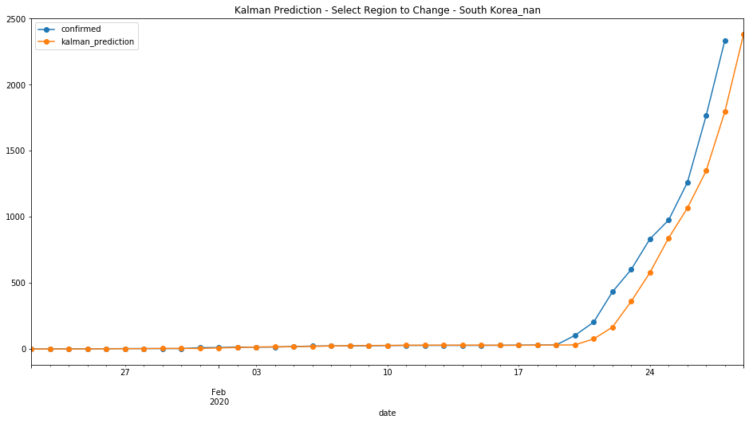
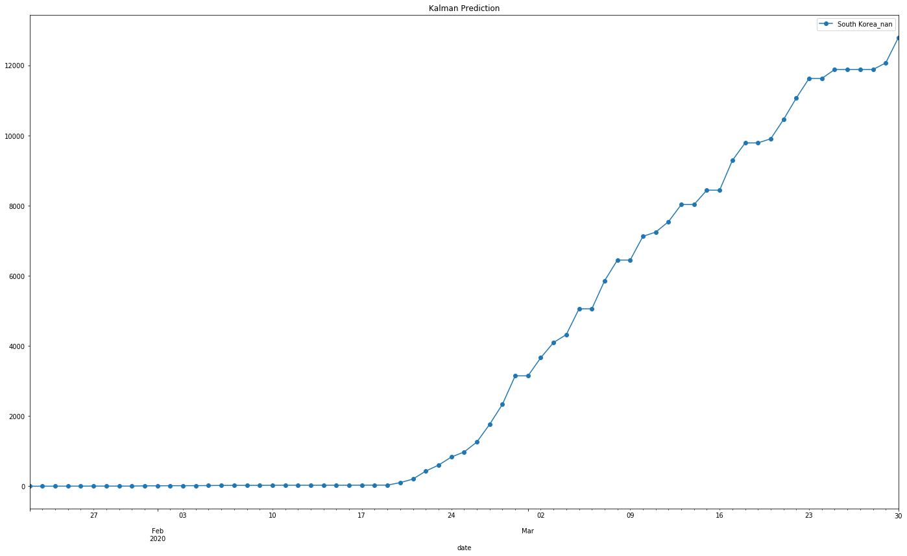

# COVID19 Forecast

## Using Kalman Filter to Forecast Corona Virus Spread
### [원작자 Ran Kremer의 Medium 아티클 원문은 여기에서 확인하실 수 있습니다.](https://medium.com/@rank23/using-kalman-filter-to-predict-corona-virus-spread-72d91b74cc8)

This work presents the implementation of an online real-time Kalman filter algorithm to predict the spread of COVID19 per given region.
Coronavirus (COVID19) has recently caused major worldwide concern.
As the number of coronavirus cases reportedly increases, the spread of COVID19 is a serious threat to global health. 
In this work, we will try to predict the spread of coronavirus for each one of the infected regions. 
Fitting time series analysis and statistical algorithms to produce the best short term and long term prediction. 
An adaptive online Kalman filter provides us very good one-day predictions for each region.

## [Kalman Filter을 이용한 대한민국의 코로나19 확산/사망/완치 경향 예측: Google Colab](https://colab.research.google.com/drive/1xC3R-vq-P4jthhOPMaMP-Bq6R7gOplsH)

### Short Term Forecast (국내 확진자 수 단기 예측: 1일)

- y축은 확진자수, x축은 날짜입니다.
- 파란색은 실제 데이터값, 노란색은 예측치입니다. 

### Long Term Forecast (국내 확진자 수 장기 예측: 30일)

- y축은 확진자수, x축은 날짜입니다.
- 파란색은 Kalman Filter 예측치입니다.

|            | '20년 2월 29일까지의 데이터를 이용한 예상 확진자 수 |
| :--------- | :-------------------------------------------------- |
| date       | South Korea_nan                                     |
| 2020-03-01 | 3166.0                                              |
| 2020-03-02 | 3783.0                                              |
| 2020-03-03 | 4005.0                                              |
| 2020-03-04 | 4199.0                                              |
| 2020-03-05 | 4630.0                                              |
| 2020-03-06 | 4927.0                                              |
| 2020-03-07 | 5402.0                                              |
| 2020-03-08 | 5864.0                                              |
| 2020-03-09 | 5864.0                                              |
| 2020-03-10 | 6494.0                                              |
| 2020-03-11 | 6494.0                                              |
| 2020-03-12 | 7154.0                                              |
| 2020-03-13 | 7215.0                                              |
| 2020-03-14 | 7215.0                                              |
| 2020-03-15 | 7215.0                                              |

이 연구는 실시간 Kalman Filter 알고리즘을 이용하여 코로나19(COVID19)의 각 지역 별 확산을 예측합니다. 

* 중국의 경우는 각 성(省) 별로 인구 데이터가 나누어져 있습니다.
* 한국을 포함한 다른 지역들은 국가 단위로 인구 데이터가 나누어져있습니다.

코로나19는(COVID19) 세계 각국에 퍼져서, 혼란을 야기했습니다. 
이 연구에서 우리는 코로나19가 각 지역에서 어떻게 퍼질 지를 예측해보려고 합니다. 시계열 데이터 분석과 통계 알고리즘으로 정확한 단기적인 예측과 장기적인 예측을 해볼 것입니다.

이 연구에서 우리는 Kalman Filter은 1) 다음날의 확진자 수를 정확하게 예측하며, 2) 단기적인 기간의 확진자 증가 수를 예측할 수 있음을 알 수 있습니다. 

저는 Ran Kremer의 모델을 대한민국의 경우에 한정해서 확진자 수 / 사망자 수 / 완치자 수의 경향을 예측해보려고 합니다. 
